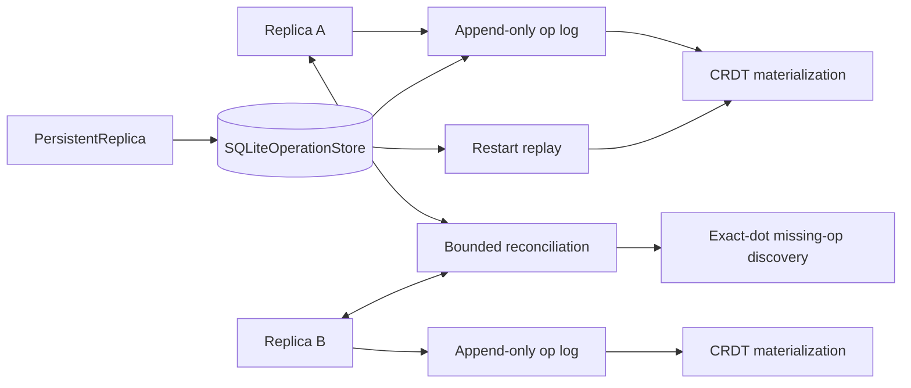

# Architecture

SyncLattice is a local-first replicated state engine. The design separates causal metadata, CRDT materialization, reconciliation, and local durability so convergence behavior remains explicit and testable.

## System view



## Engineering invariants

| Concern | SyncLattice behavior |
| --- | --- |
| Operation identity | Every mutation has an immutable `(actor, sequence)` dot. |
| Duplicate delivery | Reapplying identical operations is idempotent. |
| Identity conflict | Reusing an existing dot with different content is rejected. |
| Causal metadata | Vector clocks represent causal partial-order context, not proof that every lower sequence arrived. |
| Missing-op discovery | Reconciliation compares exact known dots so delivery holes such as receiving `A:3` before `A:2` are repairable. |
| Register convergence | LWW winner selection uses a deterministic `(logicalTime, actor, sequence)` order. |
| OR-Set convergence | Removes retain observed add dots as tombstones, including remove-before-add delivery. |
| Bounded sync | Reconciliation transfers bounded missing-operation batches in both directions. |
| Durable append | A complete SQLite operation, context, and removed-dot set are persisted in one transaction. |
| Crash recovery | Persistent replicas commit before materialization and reconstruct in-memory state by replay after restart. |
| Local durability | SQLite uses WAL, full synchronous durability, foreign keys, and a bounded busy timeout. |
| Verification | JDK 21/25 CI covers deterministic tests, shuffled duplicate-delivery convergence and file-backed SQLite restart behavior. |
| Delivery integrity | v0.1.0 publishes JAR/POM/sources, SHA-256 checksums, Maven package artifacts, and build-provenance attestations. |
| Supply chain | Third-party Actions in CI, CodeQL and release workflows are pinned to reviewed immutable commits. |

## Core model

Each mutation has an immutable `Dot(actor, sequence)` identity and a vector-clock context. Replicas keep an append-only operation log keyed by exact dots and materialize two CRDTs: a deterministic LWW register and an observed-remove set.

## Convergence

The register winner is chosen by `(logicalTime, actor, sequence)`, making delivery order irrelevant. OR-Set removes record the add dots observed at removal time. Tombstones are retained so a removed add cannot reappear if that add arrives after its remove.

The convergence tests deliberately replay concurrent and duplicate operations in fixed shuffled orders. This is evidence about the implemented CRDT rules, not a claim that arbitrary future CRDTs automatically converge.

## Reconciliation

Peers exchange exact known-dot sets and request bounded batches of missing operations. Vector clocks are intentionally not used as the sole missing-operation detector because a max counter cannot represent delivery holes. Reconciliation fetches both directions concurrently with Kotlin coroutines, then applies each bounded batch idempotently.

Both `Replica` and `PersistentReplica` implement the same `SyncPeer` contract, keeping synchronization semantics independent of whether a peer is memory-only or SQLite-backed.

## Durable local operation log

`SQLiteOperationStore` uses a normalized schema with three logical pieces: the operation row, zero or more vector-clock context rows, and zero or more OR-Set removed-dot rows. One operation is appended in one SQLite transaction. Reusing an existing dot with identical content is an idempotent replay; reusing it with different content is rejected.

`PersistentReplica` follows a durable-first mutation order: append to SQLite, then apply to the in-memory materialization. A crash after the commit but before materialization can therefore be recovered by replay on restart.

```text
new operation
    |
    v
SQLite transaction
    |
    +--> operation row
    +--> vector-clock context rows
    +--> OR-Set removed-dot rows
    |
    v
commit
    |
    v
apply to in-memory CRDT
```

This is deliberately not a transaction with an external business side effect. If a host application needs crash-atomic coordination between SyncLattice state and another system, that requires an additional application-level protocol.

## Current trust boundary

The engine accepts in-process `Operation` objects and local SQLite paths. There is no untrusted wire decoder, authentication, encryption, or network protocol in v0.1.0.

Future transport work requires explicit message-size bounds, peer authentication, replay handling, transport encryption, protocol versioning, and threat modeling before that boundary can be considered production-ready.

## Explicit non-claims

SyncLattice v0.1.0 does not claim:

- consensus or leader election;
- linearizability or global serial order;
- exactly-once transport/delivery;
- network transport or authenticated peer discovery;
- crash-atomic coordination with external side effects;
- tombstone compaction without additional causal/retention guarantees;
- production distributed-database semantics.

These limits are part of the design documentation so CRDT convergence and local durability are not mistaken for stronger distributed-systems guarantees.
